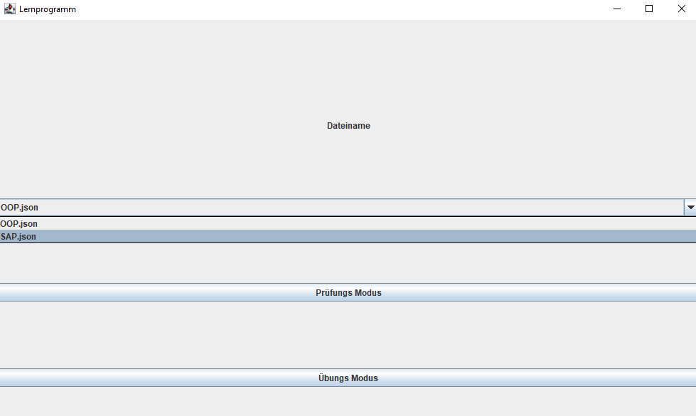
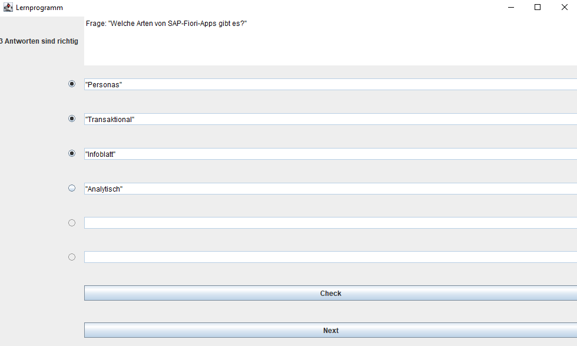
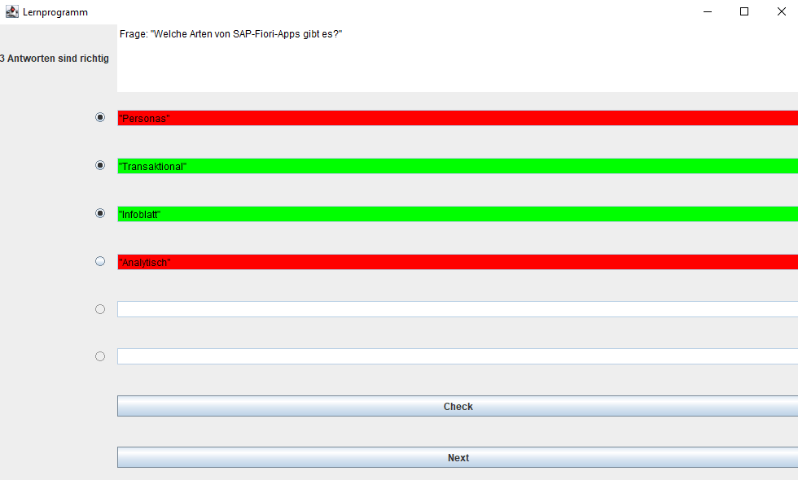

# Lernprogramm  

# About  
- Hier handelt es sich um ein Lernprogramm mit dem man Multiple Choice Fragen üben kann.  
- Zusätlich gibt es noch einen [Editor](https://github.com/leruffy/JsonEditor), der das Schreiben der Fragenkataloge erleichtert.

# Overview  
Nach dem Starten des Programmes öffnet sich das Hauptmenü:  
  
Hier kann man die Datei auswählen welche geladen werden soll und zwischen dem Prüfungsmodus und
dem Übungsmodus wählen  
   
Nach dem Auswählen eines Modus, startet das Programm mit der ersten Frage:  
  
Beantwortet werden die Fragen durch Klicken auf die Radiobuttons und überprüft anschließend
durch Klicken auf Check.  
   
Nach dem Überprüfen werden alle falschen Felder Rot und die richtigen Felder Grün   
  
Zusätzlich werden im Prüfungsmodus die Radiobuttons gesperrt, sodass die Antworten nicht korrigiert werden können.
   
Im Prüfungsmodus gibt es ein Fragen sowie Zeitlimit.  
Nach Ablauf der Zeit oder nach beantwortung der letzten Frage bekommt man das Ergebnis angezeigt:  
  
Als bestanden wird eine Prüfung gewertet bei der mindestens 50 % der Fragen richtig sind.  
Das Fragen oder Zeitlimit kann aktuell noch nicht geändert werden sondern ist Hardcoded auf 60 Fragen
und 60 Minuten

---
