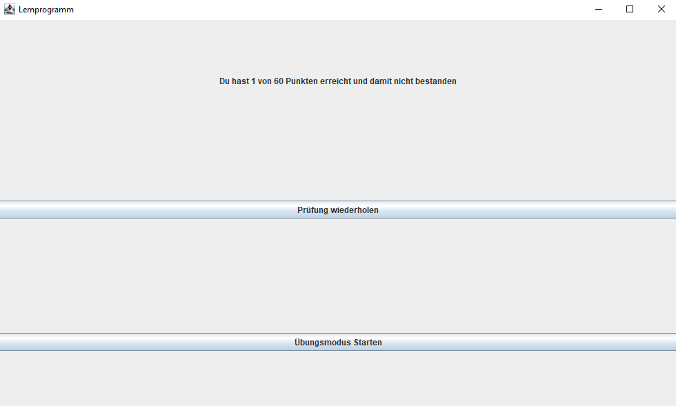

# Lernprogramm  

---

# Overview  
Nach dem Starten des Programmes öffnet sich das Hauptmenü
  
Hier kann man die Datei auswählen welche geladen werden soll und zwischen dem Prüfungsmodus und
dem Übungsmodus wählen  
  
Nach dem Auswählen eines Modus, startet das Programm mit der ersten Frage.
Hierbei ist egal welcher Modus, die Oberfläche sieht in beiden Fällen identisch aus.  
Beantwortet werden die Fragen durch Klicken auf die Radiobuttons und überprüft anschließend
durch Klicken auf Check.  
  
Nach dem Überprüfen werden alle falschen Felder Rot, die richtigen Felder Grün und
im Prüfungsmodus die Radiobuttons gesperrt, sodass die Antworten nicht korrigiert werden können.  
 
Wenn der Prüfungsmodus gestartet wurde, gibt es ein Fragen sowie Zeitlimit.  
Nach Ablauf der Zeit oder nach beantwortung der letzten Frage bekommt man das Ergebnis angezeigt:  
  
Als bestanden wird eine Prüfung gewertet bei der mindestens 50 % der Fragen richtig sind.  
Das Fragen oder Zeitlimit kann aktuell nicht geändert werden sondern ist Hardcoded auf 60 Fragen
und 60 Minuten

---